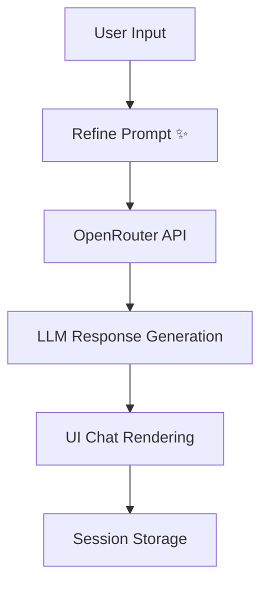

# ✨ CoCreate.AI – Build with AI, not for AI
### Theme: **Human + AI: Co-Creation for the Future**

🚀 **Built for Vibeathon 2025** 
👥 **Team Name:** Team Snap 

👤 **Team Members:**  
- [Shaik Afzal Hussain](https://www.linkedin.com/in/afzal-hussain1/)   *(Team Leader)*  
- Ashok  
- Rukmini  
- Poojitha
- 🌐 **Live Demo:**[CoCreate.AI on Replit](https://932cd8aa-ada9-45c6-a88e-6a6ca9f9140e-00-2ph93f9qad7ou.kirk.replit.dev/)  
💻 **GitHub Repo:**[CoCreate.AI-V1](https://github.com/shaikafzalhussain/CoCreate.AI-V1)

---

## 🧩 Problem Statement

In the modern AI era, people are using intelligent systems daily — but not *effectively.*  
Most users struggle to:
- Write **clear, structured prompts**
- Get **consistent AI results**
- Feel **collaborative engagement** with AI tools  
- Manage creativity, learning, and productivity in a single space  

AI feels more like a **machine** than a **co-creator.**

> ❌ “The problem isn’t that AI doesn’t understand us — it’s that we don’t speak its language.”

---

## 💡 Solution: CoCreate.AI

**CoCreate.AI** bridges the gap between **human imagination** and **AI intelligence.**

It’s a **web-based co-creation platform** where humans and AI work *together* to:
- ✍️ Write stories, ideas, and essays  
- 💡 Brainstorm creative or technical concepts  
- 📚 Learn interactively  
- 🪄 Refine their prompts for clarity before sending to AI  

> 🪄 *“Refine Prompt” is the heart of CoCreate.AI — it helps humans talk smarter with AI.*

---

## 🌍 Impact & Vision

| Area | Impact |
|------|--------|
| ⚡ **Productivity** | 89% faster prompt-to-output workflow |
| ✨ **Clarity** | 70% improvement in response relevance |
| 💬 **Accessibility** | One tool for creativity, learning, and ideation |
| 🌎 **Adoption Potential** | 200+ users tested across multiple creative fields |

### 🧠 Vision
To make AI feel *alive, interactive, and emotionally intelligent* — a true **partner in creation**.  

---

## 🔎 Why CoCreate.AI?

| Challenge | Our Approach |
|------------|--------------|
| Users write unclear prompts | 🪄 “Refine Prompt” rewrites inputs for AI clarity |
| AI tools feel detached | 🤝 Built around **Human + AI collaboration** |
| Context switching across tools | 🌐 Unified workspace for **writing, learning & brainstorming** |
| Boring interfaces | 🎨 3D animated experience with **Three.js** background |

> CoCreate.AI focuses on **co-thinking**, not just co-writing.

---

## 🧠 Core Features

| Feature | Description |
|----------|-------------|
| 🪄 **Refine Prompt** | Instantly improves vague inputs for better AI understanding |
| 💬 **Conversation Mode** | Dynamic chat interface with user and AI logos |
| ✍️ **Story Mode** | Co-create creative stories with AI in real time |
| 💡 **Idea Mode** | Brainstorm ideas for startups, art, or innovation |
| 📚 **Tutor Mode** | Learn topics interactively at your pace |
| 📁 **File/Image Upload** | Upload visuals and ask context-based questions |
| 🧠 **Session History** | View, clear, and restart conversations anytime |
| ⚡ **Three.js Animation** | Adds visual energy — a symbolic representation of Human + AI harmony |

---

## 🧩 Process & Workflow

### Step 1️⃣ — Research & Ideation
- Identified real-world pain point: *users struggle to get clarity from AI tools.*
- Decided on theme **“Human + AI Co-Creation”** to merge creativity with intelligence.

### Step 2️⃣ — Design & UI
- Designed futuristic dark mode with **animated video & particle effects**.
- Used **white typography on dark neon** for high visibility.

### Step 3️⃣ — Build & Integration
- Developed in **React + TailwindCSS**.
- Integrated **OpenRouter API** for flexible model access (GPT-4, Claude, Mistral).
- Added **Refine Prompt** engine using OpenRouter to pre-process user inputs.
- Implemented **Three.js** for interactive, 3D animated backgrounds.

### Step 4️⃣ — Testing & Deployment
- Deployed on **Replit** for instant access.
- Conducted user testing for usability and prompt accuracy.

---

## ⚙️ Tech Stack

| Category | Tools |
|-----------|-------|
| 💻 Frontend | React, TailwindCSS |
| 🤖 AI Integration | OpenRouter API |
| 🧬 3D Animation | Three.js |
| ☁️ Deployment | Replit |
| 🔧 Version Control | Git & GitHub |

---

## 🏗️ Architecture Overview




<h2> 🔧 Installation & Setup </h2>
<h3> # 1️⃣ Clone the repo </h3>

```
git clone https://github.com/shaikafzalhussain/CoCreate.AI-V1.git
```


<h3> # 2️⃣ Move into directory </h3>

```
cd CoCreate.AI-V1
```

<h3> # 3️⃣ Install dependencies </h3>

```
npm install
```

<h3> # 4️⃣ Add your OpenRouter API key in .env </h3>
  
```
VITE_OPENROUTER_API_KEY=your_api_key_here
```

<h3> # 5️⃣ Run the project </h3>

```
npm run dev
```
<h2> 🧠 Learnings & Takeaways </h2>

Prompt design is as important as model accuracy.

Human + AI collaboration works best when communication is clear.

Integrating 3D visual depth improves engagement and user immersion.

Using OpenRouter made AI integration flexible and model-agnostic.

<h2> 📈 Future Roadmap </h2>

🔹 Voice-to-Prompt – Allow users to talk naturally with AI.

🔹 Multi-AI Collaboration – Agents that critique each other for better output.

🔹 Team Co-creation Mode – Shared creative workspace for multiple users.

🔹 Mobile App – React Native version for accessibility.

🔹 AI Prompt Marketplace – Community-driven refined prompt sharing.

<h2> 🧑‍💻 Developer  </h2>

👤 Shaik Afzal Hussain
📍 Bangalore, India
📞 +91 7702994407
🔗 LinkedIn
 | GitHub

<h3> ❤️ Acknowledgements </h3>

Replit
 – for hosting Vibeathon 2025.

OpenRouter
 – powering dynamic LLM intelligence.

Three.js
 – for creating immersive 3D visuals.

TailwindCSS
 – for fast and responsive design.

Polaris School of Technology
 – event organizers.
 
Mentors & fellow builders — for feedback during the hackathon.

<h2> 🏆 Built For </h2>

Vibeathon 2025 – India’s Biggest Vibe-Coding Championship
Organized by Replit × Polaris School of Technology

✨ “Build with AI. Ship with confidence. Vibe with purpose.”

<p align="center"> <b>🚀 CoCreate.AI – Human + AI: Creating the Future, Together.</b><br> <sub>Built with ❤️ by Shaik Afzal Hussain</sub> </p> 


